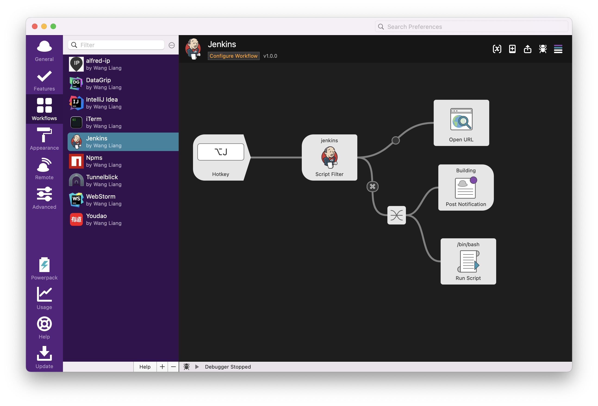
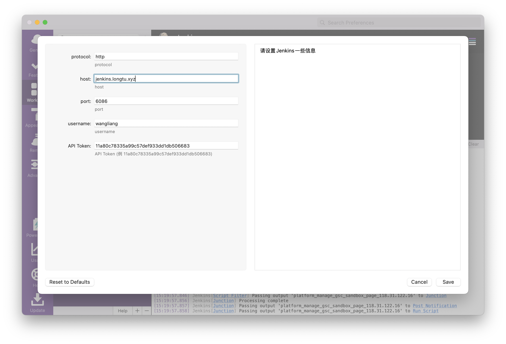
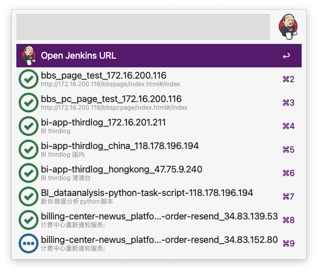

## @liangshen/alfred-jenkins

*Alfred工作流，使用Jenkins Remote Api构建项目*

### 运行环境

* MacOS
* Nodejs 14.x.x
* Alfred Powerpack

### 安装

```
npm i -g @liangshen/alfred-jenkins
```

### 使用方法

####配置工作流

点击Configure Workflow来配置工作流



配置信息如下



可使用 option + J 快捷键调出本工作流搜索框(或者调出alfred搜索框输入关键字 jenkins)



按住command键+回车将构建选中项目

直接回车选中将在浏览器中打开项目

### Changelog

* 1.1.0
  1. [x] 搜索Jenkins项目时支持 使用'|'表示或逻辑 如:xxx|xxxx 支持使用'&'表示与逻辑如: xxx&xxx 俩个逻辑同时出现时做先'&'(与)逻辑
  2. [x] 首条添加Open Jenkins URL选项 回车直接在浏览器中打开jenkins地址
  3. [x] 查询Jenkins中的所有Jobs
  4. [x] 选中一个Job回车会使用Safari打开Jenkins中此Job的界面
  5. [x] 选中一个Job按住Command+回车可以直接构建此Job


